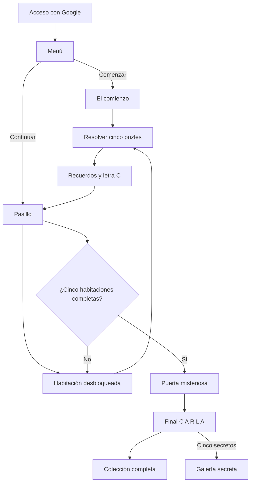

# Documentación de «Entre Nosotros»

## 1. Qué es el juego

**Entre Nosotros** es un escape room romántico mobile-first, diseñado principalmente para iPhone y construido como PWA. Carla accede con Google, recorre cinco habitaciones que representan distintas etapas de la relación, recupera cinco recuerdos en cada una y obtiene una letra especial por habitación. Las letras forman **C A R L A** y abren una sexta puerta con el desenlace.

La aplicación utiliza Next.js 16, React 19, TypeScript, Tailwind CSS 4, CSS propio, Vite, Vinext, Firebase Authentication, Cloud Firestore, `localStorage` y OpenAI Sites.

Demo: [Entre Nosotros](https://entre-nosotros-escape-room.chatpilila.chatgpt.site)

## 2. Flujo del juego



La primera partida entra en **El comienzo** y muestra un prólogo. Al volver al pasillo aparecen las cinco puertas con uno de estos estados:

- **Bloqueada:** la habitación anterior todavía no está completada.
- **Disponible:** puede abrirse, pero aún no tiene progreso.
- **En progreso:** ya contiene algún puzle resuelto.
- **Completada:** sus cinco recuerdos y su letra están recuperados.

Completar una habitación desbloquea la siguiente. Cualquier habitación ya disponible puede volver a visitarse.

## 3. Las habitaciones

### El comienzo

Reutiliza la habitación y los cinco puzles originales: fecha, canción, lugar, fotografía deslizante y código final. Conserva el tono oscuro, misterioso y romántico. Su recompensa es la letra **C**.

### Nuestras aventuras

Utiliza azules nocturnos, dorado, mapas, equipaje, billetes y postales. Incluye puzles configurables de cronología de viajes, fotografía, destino, descubrimiento y fecha. Su recompensa es la letra **A**.

### Nuestro día a día

Representa una casa cálida con sofá, televisión, nevera, teléfono y altavoz. Sus pruebas tratan comidas, series, conversaciones, canciones y complicidad. Incluye un teléfono ficticio con Mensajes, Fotos, Música, Mapas y Notas. Su recompensa es la letra **R**.

### Carla

Es una habitación más luminosa, rosa y elegante. Sus puzles de descubrimiento revelan mensajes sobre lo que el compañero ama, admira o quiere decirle a Carla. No funciona únicamente como examen de memoria. Su recompensa es la letra **L**.

### Nuestro futuro

Empieza casi vacía y se llena de estrellas a medida que progresa. Sus pruebas hablan de destinos, planes, sueños, imágenes aún no tomadas y fechas futuras. Al completarse muestra los textos configurables sobre todo lo que todavía queda por llenar juntos. Su recompensa es la letra **A**.

## 4. Puzles y mecánicas

Todos los puzles se describen en `data/gameConfig.ts` mediante un campo `type`. `PuzzleRenderer` selecciona el componente adecuado sin duplicar habitaciones.

Tipos disponibles:

- `code`: teclado de cuatro cifras.
- `choice`: selección entre opciones.
- `photo`: rompecabezas deslizante 3 × 3.
- `discovery`: elección con una revelación personal posterior.
- `phone`: interfaz móvil ficticia con pequeñas aplicaciones.

Cada puzle puede declarar `hints`. Después de dos intentos incorrectos aparece la pregunta **¿Quieres una pista?**. Carla decide cuándo mostrar cada pista y estas se revelan de una en una. Los intentos solo existen durante la sesión actual.

### Puzle fotográfico

`PhotoPuzzle` recibe `image` e `imageAlt`. Divide visualmente la imagen en nueve posiciones mediante `background-size` y `background-position`, mantiene ocho piezas y un hueco, y solo admite movimientos horizontales o verticales adyacentes.

Ejemplo de configuración:

```ts
{
  type: 'photo',
  image: '/memories/primer-viaje.webp',
  imageAlt: 'Carla durante nuestro primer viaje'
}
```

### Teléfono

`PhonePuzzle` recibe desde configuración las aplicaciones visibles, la aplicación que contiene la pista, la conversación, la pregunta, las respuestas y la solución. Los componentes no contienen conversaciones personales fijas.

### Descubrimiento

`DiscoveryPuzzle` presenta una pregunta, tres opciones y una `revelation`. La revelación solo aparece después de seleccionar la respuesta configurada y puede expresar algo que el compañero piensa sobre Carla.

## 5. Recuerdos, letras y secretos

Cada habitación contiene cinco recuerdos. Cada recuerdo acepta:

```ts
type Memory = {
  id: string;
  title: string;
  description: string;
  image?: string;
  imageAlt: string;
  optionalDate?: string;
  optionalLocation?: string;
  optionalExtraText?: string;
  audio?: string;
};
```

La colección permite cambiar de habitación y muestra contadores como **El comienzo — 5/5**. Las habitaciones bloqueadas no se pueden seleccionar y los recuerdos pendientes continúan ocultos.

Al completar cada habitación se muestra `RoomCompleteReveal` con su letra. El pasillo mantiene una cerradura visual de cinco posiciones que termina mostrando **C A R L A**.

Cada habitación incluye un coleccionable secreto opcional. No es necesario para avanzar. Encontrar los cinco habilita la **Galería secreta** del final.

## 6. Audios y respuesta háptica

`AudioMessage` reproduce archivos definidos desde configuración. Incluye reproducción, pausa y progreso. No inicia sonido automáticamente, por lo que es compatible con las restricciones de Safari iOS.

`lib/haptics.ts` intenta usar `navigator.vibrate` al resolver un puzle o encontrar un secreto. La vibración nunca transmite información imprescindible y falla silenciosamente cuando iPhone o el navegador no la admiten.

## 7. Final

Cuando las cinco habitaciones están completadas, el pasillo muestra una sexta puerta con `?`. Esa escena no contiene puzles. Presenta los mensajes de `gameConfig.final.messages` de forma secuencial y después muestra un corazón.

Al tocar el corazón aparecen:

- El mensaje final configurable.
- Las letras **C A R L A**.
- El audio final opcional.
- El acceso a todos los recuerdos.
- **Hay algo más…** cuando se han encontrado los cinco secretos.

## 8. Progreso y migración

El formato actual es:

```ts
type GameProgress = {
  version: 2;
  started: boolean;
  currentRoomId: RoomId;
  rooms: Record<RoomId, {
    unlocked: boolean;
    completed: boolean;
    puzzles: boolean[];
  }>;
  secrets: string[];
  legacy?: {
    started: boolean;
    completed: boolean[];
  };
};
```

Se guarda en:

- `localStorage`, clave `between-us-progress`.
- Cloud Firestore, documento `gameProgress/{uid}`.

### Migración de partidas anteriores

`migrateProgress` reconoce el formato anterior:

```json
{
  "started": true,
  "completed": [true, true, false, false, false]
}
```

Esos cinco valores pasan a `rooms.beginning.puzzles`. Si los cinco son verdaderos, **El comienzo** se marca como completado y se desbloquea **Nuestras aventuras**.

La migración se ejecuta tanto al leer `localStorage` como al descargar Firestore. El guardado nuevo conserva una copia en `legacy`. En Firestore se usa escritura con `merge`, por lo que el campo antiguo `completed` no se elimina durante la migración. Al reiniciar voluntariamente la partida se guarda además el array antiguo con cinco valores falsos para impedir una remigración accidental.

Cuando existen progreso local y progreso en la nube:

- Los puzles completados se combinan con una operación OR.
- Los secretos se unen sin duplicados.
- Los desbloqueos se reconstruyen en orden.
- Nunca se cambia un puzle completado a pendiente durante la mezcla.

## 9. Reiniciar partida

El menú muestra una opción discreta **Reiniciar partida** cuando existe progreso. Abre una confirmación explícita. Al aceptar:

- Restablece habitaciones, puzles y secretos en local.
- Actualiza el mismo documento de Firestore.
- Conserva la sesión de Google.
- No elimina la cuenta ni cierra sesión.

## 10. Arquitectura

```text
escape-room/
├── app/
│   ├── firebase-auth/[...path]/route.ts
│   ├── globals.css
│   ├── layout.tsx
│   ├── manifest.ts
│   └── page.tsx
├── components/
│   ├── AudioMessage.tsx
│   ├── AuthScreen.tsx
│   ├── FinalRoom.tsx
│   ├── HintSystem.tsx
│   ├── MainMenu.tsx
│   ├── MemoryDrawer.tsx
│   ├── MemoryReveal.tsx
│   ├── RoomCompleteReveal.tsx
│   ├── RoomHub.tsx
│   ├── RoomScreen.tsx
│   ├── SecretCollectible.tsx
│   └── SecretGallery.tsx
├── data/gameConfig.ts
├── hooks/
│   ├── useGameProgress.ts
│   └── useGoogleAuth.ts
├── lib/
│   ├── firebase.ts
│   ├── firebaseAuthProxy.ts
│   └── haptics.ts
├── public/
│   ├── audio/
│   └── memories/
├── puzzles/
│   ├── ChoicePuzzle.tsx
│   ├── CodePuzzle.tsx
│   ├── DiscoveryPuzzle.tsx
│   ├── PhonePuzzle.tsx
│   ├── PhotoPuzzle.tsx
│   ├── PuzzleRenderer.tsx
│   └── PuzzleShell.tsx
└── types/game.ts
```

Responsabilidades principales:

- `app/page.tsx`: orquesta pantallas y modales; no contiene soluciones personales.
- `data/gameConfig.ts`: única fuente de contenido personal.
- `types/game.ts`: contratos de habitaciones, puzles, recuerdos y progreso.
- `hooks/useGameProgress.ts`: migración, mezcla, guardado, desbloqueo y reinicio.
- `RoomHub`: pasillo, estados de puertas, letras y puerta final.
- `RoomScreen`: escena genérica dirigida por el tema y los objetos configurados.
- `PuzzleRenderer`: une cada `type` de configuración con su mecánica React.
- Firebase Authentication: identidad Google.
- Firestore: progreso durable por usuario.
- `localStorage`: copia local y compatibilidad histórica.

No existe un backend propio. Firebase es el backend administrado. Las reglas siguen limitando cada documento a su `uid`; la nueva estructura no necesita ampliar permisos.

## 11. Personalizar a Carla

Todo se edita en `data/gameConfig.ts`. Busca `TODO: PERSONALIZAR`. Allí están:

- `couple.playerName` y `couple.partnerName`.
- Títulos, subtítulos e introducciones.
- Fechas y códigos.
- Canciones y lugares.
- Viajes y planes.
- Conversaciones del teléfono.
- Preguntas, respuestas y revelaciones.
- Recuerdos.
- Secretos.
- Mensajes y audio final.

Las respuestas de `choice`, `discovery` y `phone` deben coincidir exactamente con una entrada de su array de opciones. Los códigos deben tener cuatro caracteres numéricos.

No se deben colocar credenciales Firebase ni secretos técnicos en este archivo. Las variables Firebase permanecen en `.env.local` y `.env.example` solo documenta sus nombres.

## 12. Fotografías

Coloca las fotos en `public/memories/`, preferiblemente WebP optimizado. Una ruta como:

```text
public/memories/primer-viaje.webp
```

se referencia así:

```ts
image: '/memories/primer-viaje.webp'
```

Define siempre `imageAlt`. `MemoryDrawer` y `MemoryReveal` utilizan `next/image`, `object-fit: cover` y recorte adaptado a tarjetas verticales. `PhotoPuzzle` usa la misma ruta como fondo dividido en piezas.

Las fotografías incluidas en un repositorio público también serán públicas. Revisa la privacidad del repositorio antes de añadir imágenes reales.

## 13. Audios

Coloca los archivos en `public/audio/`. M4A y MP3 son opciones habituales para Safari iOS.

```ts
audio: '/audio/carla-room-message.m4a'
```

Puede añadirse `audio` a un recuerdo o a `gameConfig.final.audio`. No se almacenan bytes ni rutas en Firestore.

## 14. Añadir una habitación

1. Añade su identificador a `RoomId` en `types/game.ts`.
2. Añade un objeto a `gameConfig.rooms` con tema, textos, recompensa, cinco objetos, puzles, recuerdos y secreto.
3. Añade su identificador a `RoomTheme` si necesita un tema nuevo.
4. Define las variables visuales o selectores `.room-theme-*` y `.door-*` en `app/globals.css`.
5. La habitación entra automáticamente en el pasillo, la colección, el progreso, el desbloqueo y el final.

## 15. Añadir un puzle

Para reutilizar un tipo existente, añade una entrada en `room.puzzles` y un objeto visual en la misma posición de `room.objects`. La memoria con el mismo índice será su recompensa.

Para crear un tipo nuevo:

1. Añade su interfaz al tipo discriminado `PuzzleConfig`.
2. Crea un componente en `puzzles/`.
3. Añade una rama en `PuzzleRenderer`.
4. Haz que el componente llame `onSolve` al ganar y `onWrong` al fallar.
5. Mantén todo texto personal dentro de `gameConfig.ts`.

## 16. iPhone, PWA y accesibilidad

- El juego usa `100dvh`, ancho máximo de 480 px y safe areas.
- Los controles táctiles principales alcanzan al menos 44 px.
- El manifiesto mantiene `display: standalone` y `portrait-primary`.
- No se modificaron los iconos PWA ni el flujo de instalación.
- Los objetos interactivos son botones con etiquetas accesibles.
- Los modales usan `role="dialog"`, `aria-modal` y títulos asociados.
- Las imágenes requieren texto alternativo.
- Los audios nunca empiezan solos.
- `prefers-reduced-motion` reduce todas las animaciones.
- La respuesta háptica es opcional.

## 17. Desarrollo y despliegue

```bash
pnpm install
pnpm dev
pnpm exec tsc --noEmit
pnpm lint
pnpm build
```

Vinext genera la salida de Cloudflare Workers en `dist/`. OpenAI Sites publica esa salida. GitHub conserva el código, pero no despliega automáticamente la web.

La autenticación Google sigue utilizando Firebase y el proxy de mismo origen bajo `/__/auth/` para conservar la sesión en navegadores con restricciones de almacenamiento entre dominios.

## 18. Privacidad y límites

- Las soluciones forman parte del JavaScript entregado al navegador; no deben tratarse como secretos.
- Firestore solo almacena progreso, no textos, fotos ni audios.
- Las reglas permiten leer y escribir únicamente `gameProgress/{uid}` cuando `request.auth.uid == uid`.
- Los placeholders deben sustituirse antes de entregar el juego definitivo a Carla.
- La PWA es instalable, pero no incorpora un service worker offline completo.
- No se han añadido fotografías ni audios reales.
