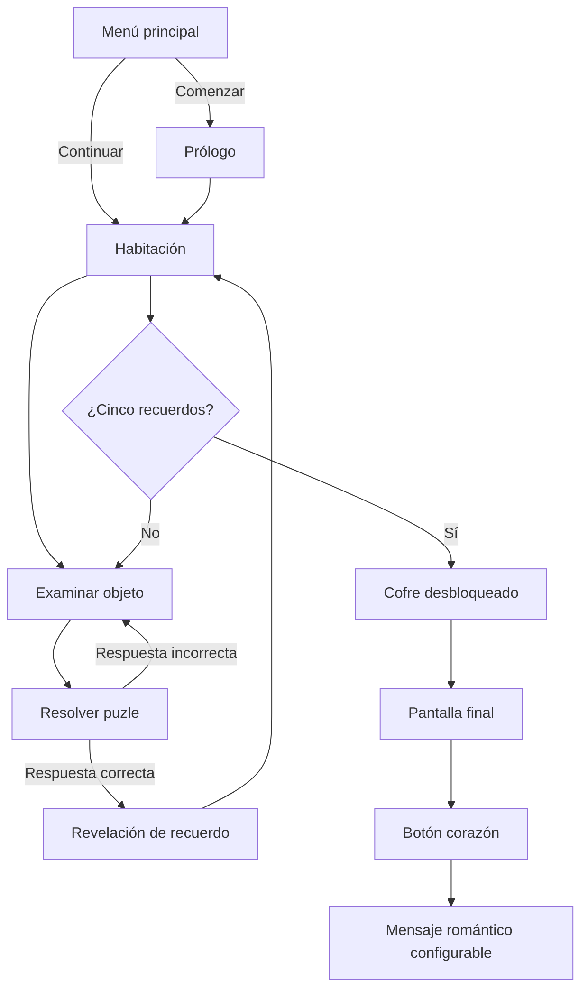
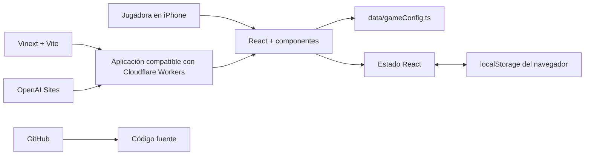

# Documentación completa de «Entre Nosotros»

## 1. Resumen del proyecto

**Entre Nosotros** es un escape room romántico diseñado como una experiencia de juego para móvil, especialmente para iPhone en orientación vertical. No intenta comportarse como una página web convencional: ocupa toda la pantalla, utiliza controles grandes, evita menús propios de escritorio y presenta la habitación, los puzles y los recuerdos mediante paneles animados superpuestos.

La premisa narrativa es sencilla: la jugadora despierta en una habitación misteriosa en la que se han encerrado cinco recuerdos de la relación. Para recuperarlos debe examinar objetos de la habitación, resolver cinco pruebas y reunir cinco fragmentos. Al completar la colección, el cofre final se desbloquea y muestra el desenlace romántico.

El proyecto está desarrollado con:

- Next.js 16.
- React 19.
- TypeScript.
- Tailwind CSS 4 y CSS propio.
- Vite como herramienta de compilación.
- Vinext como capa de compatibilidad de Next.js sobre Vite y Cloudflare Workers.
- OpenAI Sites para el despliegue actual.
- `localStorage` para guardar el progreso en el dispositivo.

Demo publicada: [Entre Nosotros](https://entre-nosotros-escape-room.chatpilila.chatgpt.site)

Repositorio: [javism15/entrenosotros](https://github.com/javism15/entrenosotros)

---

## 2. En qué consiste el juego

### 2.1. Objetivo principal

La jugadora debe recuperar cinco fragmentos de memoria. Cada fragmento está asociado a uno de los objetos interactivos de la habitación y a un puzle concreto:

1. Caja: código basado en una fecha importante.
2. Radio: selección de una canción.
3. Mapa: selección de un lugar.
4. Fotografía: rompecabezas deslizante.
5. Reloj: código final compuesto con pistas anteriores.

Cuando los cinco fragmentos están desbloqueados, el cofre central deja de estar cerrado. Al tocarlo se accede a la pantalla final.

### 2.2. Flujo completo de una partida



### 2.3. Menú principal

El menú muestra:

- El título configurable del juego.
- El texto introductorio sobre los recuerdos perdidos.
- El botón **Comenzar**.
- El botón **Continuar partida**, únicamente si el navegador contiene una partida guardada.
- Cinco pequeños indicadores visuales que anticipan los cinco fragmentos.

Al pulsar **Comenzar**, se crea una partida nueva con todos los puzles incompletos. Después aparece un prólogo que introduce la misión.

Al pulsar **Continuar partida**, se accede directamente a la habitación utilizando el progreso recuperado desde `localStorage`.

### 2.4. Prólogo

El prólogo se presenta como un diálogo a pantalla completa. Utiliza `playerName` para dirigirse a la jugadora y explica que los recuerdos se encuentran encerrados en la habitación.

No es una ruta independiente. Es una capa modal controlada por estado React dentro de la página principal.

### 2.5. Habitación principal

La habitación es el centro de la experiencia. Contiene:

- Una caja.
- Una radio.
- Un mapa.
- Una fotografía.
- Un reloj.
- Un cofre final.
- Un acceso a la colección de recuerdos.
- Un texto de pista que cambia según el avance.
- Un contador de fragmentos recuperados.

Los objetos se representan como botones absolutos situados sobre una escena construida con CSS. Esto permite que sean accesibles, táctiles y fáciles de mantener sin depender todavía de una imagen definitiva de la habitación.

Los estados visuales de un objeto son:

- **Disponible:** muestra su símbolo y una animación luminosa.
- **Completado:** muestra una marca de verificación.
- **Bloqueado:** el reloj permanece cerrado hasta haber completado los cuatro primeros puzles.

Si se toca un objeto ya completado, no se vuelve a resolver su puzle: se abre directamente el recuerdo correspondiente.

### 2.6. Puzle 1: la caja y la fecha importante

La caja abre el puzle **La primera llave**.

Funcionamiento:

- Se muestra un teclado numérico táctil.
- La jugadora introduce cuatro cifras.
- La solución se compara con `importantDate`.
- Si el código es incorrecto, la interfaz tiembla, borra la entrada y muestra un mensaje de error.
- Si es correcto, se completa el puzle y se revela el primer recuerdo.

La respuesta provisional actual es `1402`. Se cambia en `data/gameConfig.ts`.

### 2.7. Puzle 2: la radio y la canción

La radio abre **Nuestra frecuencia**.

Funcionamiento:

- Se presentan varias canciones como botones grandes.
- Las opciones proceden del array `songs`.
- La respuesta correcta es el valor de `correctSong`.
- Una selección incorrecta muestra una reacción visual y el mensaje «Ese recuerdo suena distinto…».
- La canción correcta desbloquea el segundo fragmento.

Para que este puzle funcione correctamente, `correctSong` debe coincidir exactamente con uno de los textos incluidos en `songs`.

### 2.8. Puzle 3: el mapa y el lugar

El mapa abre **Coordenadas del corazón**.

Su comportamiento reutiliza el componente genérico de selección del puzle musical:

- `locations` contiene las opciones visibles.
- `correctLocation` contiene la respuesta válida.
- El símbolo y el contenido cambian para representar localizaciones.
- Una respuesta correcta desbloquea el tercer recuerdo.

`correctLocation` debe coincidir exactamente con una entrada de `locations`.

### 2.9. Puzle 4: la fotografía

La fotografía abre **Imagen fragmentada**.

Es un rompecabezas deslizante de 3 × 3:

- Ocho casillas contienen piezas.
- Una casilla se encuentra vacía.
- Solo se puede mover una pieza adyacente al espacio vacío.
- La adyacencia puede ser horizontal o vertical, nunca diagonal.
- El orden resuelto es `1, 2, 3, 4, 5, 6, 7, 8, vacío`.
- El botón **Reiniciar piezas** restaura la distribución inicial.

La versión actual utiliza números y colores como contenido provisional. El componente está preparado para sustituirlos más adelante por secciones de una fotografía real.

### 2.10. Puzle 5: el reloj y el código final

El reloj abre **La última combinación** y solo está disponible cuando se han completado los cuatro puzles anteriores.

Antes del teclado se muestra una tira de pistas:

- Las dos primeras cifras de la fecha importante.
- La cantidad de fragmentos anteriores completados, expresada con dos cifras.

Con la configuración actual:

- Fecha: `14`.
- Fragmentos previos: `04`.
- Código final: `1404`.

La solución se guarda en `finalCode`. Si se cambia la fecha o la lógica de la pista, también debe revisarse `finalCode` para que el código mostrado y la respuesta esperada sigan siendo coherentes.

### 2.11. Sistema de recuerdos

Cada puzle está asociado por su índice a una entrada del array `memories`:

| Índice | Objeto | Fragmento |
|---:|---|---|
| 0 | Caja | Recuerdo 1 |
| 1 | Radio | Recuerdo 2 |
| 2 | Mapa | Recuerdo 3 |
| 3 | Fotografía | Recuerdo 4 |
| 4 | Reloj | Recuerdo 5 |

Cada memoria soporta:

- `title`: título visible.
- `description`: texto romántico o narrativo.
- `image`: identificador provisional de imagen.

Al completar un puzle aparece `MemoryReveal`, una pantalla de recompensa animada. El recuerdo también queda disponible de forma permanente en `MemoryDrawer`, la colección accesible desde la habitación.

En la colección, los fragmentos pendientes aparecen atenuados y con un candado. Los recuperados muestran su título y descripción.

### 2.12. Cofre y desenlace

El cofre comprueba `progress.completed.every(Boolean)`. Mientras exista un puzle incompleto, tocarlo no produce la transición final.

Cuando los cinco valores son `true`:

- El cofre cambia de estilo.
- Empieza a emitir luz y una pequeña animación.
- El texto inferior cambia a **ÁBREME**.
- Al tocarlo, la pantalla activa pasa de `room` a `ending`.

La pantalla final muestra, en este orden:

1. «Has recuperado todos nuestros recuerdos.»
2. «Pero todavía nos quedan muchos por crear.»
3. Un botón con forma de corazón.
4. Al tocar el corazón, el mensaje almacenado en `finalMessage`.
5. La firma configurada mediante `partnerName`.

También permite volver a abrir la colección completa de recuerdos.

---

## 3. Guardado y recuperación del progreso

El juego no necesita una cuenta de usuario ni una base de datos. El estado persistente se guarda en el navegador mediante `localStorage`.

La clave utilizada es:

```text
between-us-progress
```

El objeto guardado tiene esta forma:

```ts
type GameProgress = {
  started: boolean;
  completed: boolean[];
};
```

Ejemplo de una partida con los dos primeros puzles resueltos:

```json
{
  "started": true,
  "completed": [true, true, false, false, false]
}
```

El hook `useGameProgress` se encarga de:

1. Esperar a que React se ejecute en el navegador.
2. Leer el progreso guardado.
3. Validar que `completed` sea un array de cinco elementos.
4. Exponer el estado a la interfaz.
5. Guardar automáticamente cada cambio.
6. Marcar un puzle concreto como completado sin modificar los demás.
7. Poder borrar el progreso mediante `reset`, aunque actualmente no existe un botón visible que lo invoque.

### Consecuencias de usar `localStorage`

- El progreso pertenece a un navegador y dispositivo concretos.
- No se sincroniza entre iPhone, ordenador u otros navegadores.
- Si se borran los datos del sitio, se pierde la partida.
- No hay datos personales almacenados en un servidor.
- El juego funciona sin inicio de sesión propio.

---

## 4. Arquitectura general

### 4.1. Vista de alto nivel



La aplicación es deliberadamente sencilla:

- Una única ruta de juego.
- Componentes React especializados.
- Estado efímero con `useState`.
- Progreso persistente con un hook y `localStorage`.
- Configuración personal centralizada.
- Sin API propia.
- Sin base de datos.
- Sin autenticación.

### 4.2. Frontend

El frontend incluye todo lo que la jugadora ve y con lo que interactúa:

- Menú.
- Habitación.
- Objetos interactivos.
- Puzles.
- Colección de recuerdos.
- Animaciones.
- Final romántico.
- PWA y metadatos móviles.

`app/page.tsx` funciona como coordinador principal. Mantiene la pantalla activa y decide qué componente se debe renderizar.

Estados principales:

```ts
type Screen = 'menu' | 'room' | 'ending';
```

Estados auxiliares:

- `activePuzzle`: índice del puzle abierto o `null`.
- `reveal`: índice del recuerdo que se está revelando o `null`.
- `memoriesOpen`: indica si la colección está abierta.
- `prologue`: indica si debe mostrarse el prólogo.

Esta organización evita introducir un gestor de estado global o una librería de navegación para una experiencia que solo necesita una ruta.

### 4.3. Backend

Actualmente **no existe un backend de aplicación tradicional**.

No hay:

- Endpoints API propios.
- Servidor de usuarios.
- Inicio de sesión.
- Base de datos SQL.
- Almacenamiento de imágenes subidas por usuarios.
- Sincronización de partidas.
- Panel de administración.

Next.js y Vinext generan una aplicación con capacidad de renderizado de servidor, pero la lógica del juego está marcada con `'use client'` y se ejecuta en el dispositivo. El servidor se limita a entregar la aplicación y sus recursos.

En `.openai/hosting.json`:

```json
{
  "d1": null,
  "r2": null
}
```

Esto confirma que no se ha habilitado:

- **D1**, la base de datos SQLite distribuida de Cloudflare.
- **R2**, el almacenamiento de objetos de Cloudflare.

Si en el futuro se quisiera sincronizar el progreso, gestionar fotografías desde un panel o proteger el juego con acceso personalizado, entonces sí sería necesario diseñar una capa backend.

### 4.4. Capa de datos

Hay dos clases de datos:

#### Datos de contenido

Viven en `data/gameConfig.ts` y forman parte del código desplegado:

- Títulos.
- Nombres.
- Fecha.
- Canciones.
- Lugares.
- Soluciones.
- Recuerdos.
- Mensaje final.

#### Datos de progreso

Viven en `localStorage` y cambian durante la partida:

- Si la partida ha comenzado.
- Qué puzles se han completado.

No se mezclan. Cambiar el contenido requiere una nueva compilación y despliegue; completar un puzle solo modifica el almacenamiento local del navegador.

---

## 5. Estructura del proyecto

```text
escape-room/
├── .openai/
│   └── hosting.json
├── app/
│   ├── globals.css
│   ├── layout.tsx
│   ├── manifest.ts
│   └── page.tsx
├── components/
│   ├── EndingScreen.tsx
│   ├── MainMenu.tsx
│   ├── MemoryDrawer.tsx
│   ├── MemoryReveal.tsx
│   └── RoomScreen.tsx
├── data/
│   └── gameConfig.ts
├── hooks/
│   └── useGameProgress.ts
├── public/
│   ├── apple-touch-icon.png
│   ├── favicon.svg
│   ├── icon-192.png
│   ├── icon-512.png
│   ├── icon-maskable-512.png
│   └── og.png
├── puzzles/
│   ├── ChoicePuzzle.tsx
│   ├── CodePuzzle.tsx
│   ├── PhotoPuzzle.tsx
│   └── PuzzleShell.tsx
├── scripts/
│   └── generate_icons.py
├── styles/
│   └── theme.css
├── .gitignore
├── DOCUMENTACION.md
├── README.md
├── eslint.config.mjs
├── next.config.ts
├── package.json
├── pnpm-lock.yaml
├── pnpm-workspace.yaml
├── tsconfig.json
└── vite.config.ts
```

### 5.1. Directorio `app/`

Utiliza el App Router de Next.js.

#### `app/page.tsx`

Es el controlador de la experiencia:

- Carga el progreso.
- Cambia entre menú, habitación y final.
- Abre y cierra modales.
- Selecciona el puzle correcto.
- Marca los puzles como completados.
- Lanza la revelación de cada recuerdo.

#### `app/layout.tsx`

Define la estructura HTML global y los metadatos:

- Idioma español.
- Título y descripción.
- Metadatos Open Graph y X/Twitter.
- Imagen social `og.png`.
- Icono para la pantalla de inicio de iPhone.
- Configuración `appleWebApp`.
- Viewport adaptado a móviles.
- `viewportFit: 'cover'` para utilizar correctamente las zonas alrededor del notch y la Dynamic Island.
- Color de tema oscuro.

#### `app/manifest.ts`

Genera el manifiesto web de la PWA:

- Nombre completo y nombre corto.
- Ruta inicial `/`.
- Modo `standalone`.
- Orientación vertical prioritaria.
- Colores de fondo y tema.
- Iconos normales y `maskable`.

#### `app/globals.css`

Contiene el diseño general del juego:

- Habitación creada con gradientes y formas CSS.
- Posición de objetos interactivos.
- Paneles y modales.
- Teclado numérico.
- Rompecabezas fotográfico.
- Colección de recuerdos.
- Final romántico.
- Animaciones.
- Estados táctiles.
- Media queries para pantallas bajas y escritorio.
- Compatibilidad con `prefers-reduced-motion`.

### 5.2. Directorio `components/`

#### `MainMenu.tsx`

Presenta el título, el comienzo y la continuación de partida.

#### `RoomScreen.tsx`

Renderiza la habitación, el HUD, los objetos, el cofre, el contador y la pista contextual.

#### `MemoryDrawer.tsx`

Muestra la colección completa y diferencia fragmentos bloqueados y recuperados.

#### `MemoryReveal.tsx`

Presenta la recompensa animada después de resolver cada puzle.

#### `EndingScreen.tsx`

Controla las dos fases del desenlace: frases finales y revelación del mensaje al pulsar el corazón.

### 5.3. Directorio `puzzles/`

#### `PuzzleShell.tsx`

Panel reutilizable que proporciona:

- Fondo modal.
- Título.
- Pista.
- Botón de cierre.
- Contenedor para el contenido particular de cada puzle.

#### `CodePuzzle.tsx`

Puzle numérico reutilizado para la fecha y el código final.

#### `ChoicePuzzle.tsx`

Puzle de selección reutilizado por la canción y la localización.

#### `PhotoPuzzle.tsx`

Implementa el rompecabezas deslizante y su comprobación de victoria.

### 5.4. Directorio `data/`

`gameConfig.ts` es la única fuente de contenido personal. De esta manera no es necesario buscar textos o respuestas por todos los componentes.

### 5.5. Directorio `hooks/`

`useGameProgress.ts` encapsula la persistencia. Los componentes no necesitan conocer directamente la clave de `localStorage` ni la lógica de validación.

### 5.6. Directorio `styles/`

`theme.css` define las variables cromáticas principales: tonos de texto, rosa, dorado y fondo nocturno. `globals.css` importa estas variables.

### 5.7. Directorio `public/`

Contiene recursos accesibles directamente desde la raíz pública:

- Iconos PWA.
- Icono específico de Apple.
- Favicon.
- Imagen de previsualización social.

Por ejemplo, `public/icon-192.png` se sirve como `/icon-192.png`.

### 5.8. Directorio `scripts/`

`generate_icons.py` genera los iconos provisionales mediante Pillow. Permite reconstruirlos si se desea cambiar el símbolo o los colores.

### 5.9. Archivos de configuración

#### `package.json`

Declara versiones, dependencias y comandos.

#### `pnpm-lock.yaml`

Fija las versiones exactas de todas las dependencias transitivas para producir instalaciones reproducibles.

#### `tsconfig.json`

Configura TypeScript en modo estricto, resolución de módulos y el alias `@/*`.

#### `vite.config.ts`

Conecta:

- Vinext.
- Tailwind/PostCSS.
- OpenAI Sites.
- El plugin de Cloudflare.
- El entorno React Server Components.
- Las capacidades opcionales D1 y R2.

#### `next.config.ts`

Mantiene la configuración propia de Next.js. Actualmente no necesita opciones adicionales.

#### `.openai/hosting.json`

Relaciona el código local con el proyecto desplegado en Sites y declara las capacidades de persistencia del alojamiento.

#### `.gitignore`

Evita subir dependencias, resultados de compilación, cachés, archivos de entorno y paquetes de despliegue.

---

## 6. Diseño responsive y soporte para iPhone

La interfaz se construyó siguiendo una estrategia mobile-first:

- El área jugable ocupa `100dvh`, que se adapta a los cambios de altura de Safari móvil.
- La anchura máxima del juego es de 480 px.
- En escritorio el juego continúa pareciendo una pantalla móvil centrada.
- Se utilizan `env(safe-area-inset-top)` y `env(safe-area-inset-bottom)`.
- Los botones principales tienen al menos 44–56 px de altura.
- Se desactiva el resaltado táctil predeterminado.
- Se prioriza la orientación `portrait-primary`.
- No existen barras laterales ni navegación de escritorio.
- `overscroll-behavior: none` evita rebotes y desplazamientos accidentales.
- `touch-action: manipulation` mejora la respuesta de los botones.

Las animaciones se reducen automáticamente si el sistema del usuario tiene activada la preferencia **Reducir movimiento**.

---

## 7. PWA e instalación desde Safari

El proyecto incluye los elementos necesarios para añadirlo a la pantalla de inicio:

- Manifiesto web.
- Iconos de 192 y 512 px.
- Icono `maskable`.
- `apple-touch-icon`.
- Modo de visualización `standalone`.
- Metadatos `appleWebApp`.
- Color de tema.
- Viewport compatible con zonas seguras.

En iPhone:

1. Abrir la URL en Safari.
2. Pulsar **Compartir**.
3. Seleccionar **Añadir a pantalla de inicio**.
4. Confirmar el nombre.
5. Abrir el icono instalado.

El modo standalone elimina la barra habitual de Safari y hace que la experiencia se sienta más parecida a una aplicación.

La versión actual no incorpora un service worker de caché offline. Por tanto, es instalable, pero necesita conexión para realizar la carga inicial.

---

## 8. Desarrollo local

### Requisitos

- Node.js 22.13 o posterior.
- pnpm.

### Instalar dependencias

```bash
pnpm install
```

### Ejecutar el servidor de desarrollo

```bash
pnpm dev
```

El servidor utiliza Vinext y Vite. Los cambios se reflejan mediante recarga en caliente.

### Comprobar TypeScript

```bash
pnpm exec tsc --noEmit
```

### Ejecutar ESLint

```bash
pnpm lint
```

### Crear la compilación de producción

```bash
pnpm build
```

### Ejecutar la compilación

```bash
pnpm start
```

---

## 9. Proceso de compilación y despliegue

### 9.1. Compilación

El comando `pnpm build` llama a `vinext build`. La compilación genera varios entornos:

1. Referencias del cliente.
2. Referencias del servidor.
3. Entorno RSC.
4. JavaScript del cliente.
5. Entorno SSR.

El resultado se guarda en `dist/` y es compatible con Cloudflare Workers.

### 9.2. Despliegue actual

El despliegue se realiza mediante OpenAI Sites:

1. Se valida TypeScript.
2. Se crea una compilación de producción.
3. Se guarda una versión del sitio.
4. Se publica esa versión en la infraestructura de Sites.
5. Sites ejecuta la salida compatible con Cloudflare Workers.

La URL de producción actual es:

```text
https://entre-nosotros-escape-room.chatpilila.chatgpt.site
```

### 9.3. Relación entre GitHub y el despliegue

GitHub contiene el código fuente y su historial, pero la publicación actual no depende automáticamente de GitHub Actions.

En este momento son dos flujos separados:

```text
Código local → GitHub
Código local compilado → OpenAI Sites → URL de producción
```

Subir un cambio a GitHub no actualiza automáticamente la URL de Sites. Para reflejar un cambio en producción se debe volver a compilar y publicar una nueva versión.

### 9.4. Posible despliegue alternativo

Al ser un proyecto Next.js/Vinext, podría adaptarse en el futuro a otros proveedores. Sin embargo, la configuración actual está orientada a Vite, Vinext, OpenAI Sites y Cloudflare Workers; no debe asumirse que un despliegue estándar de Next.js en cualquier plataforma funcionará sin revisar esa configuración.

---

## 10. Cómo personalizar el contenido

Todo el contenido principal se modifica en:

```text
data/gameConfig.ts
```

### Campos disponibles

| Campo | Uso |
|---|---|
| `title` | Nombre del juego |
| `playerName` | Nombre o apelativo de la jugadora |
| `partnerName` | Firma del mensaje final |
| `importantDate` | Respuesta de cuatro cifras del primer puzle |
| `songs` | Opciones del puzle musical |
| `correctSong` | Canción correcta |
| `locations` | Opciones del puzle de lugares |
| `correctLocation` | Lugar correcto |
| `finalCode` | Respuesta del último teclado |
| `finalMessage` | Mensaje revelado al pulsar el corazón |
| `memories` | Cinco recuerdos con título, descripción e imagen |

### Reglas importantes

- Deben existir exactamente cinco recuerdos mientras `completed` tenga cinco posiciones.
- `correctSong` debe estar dentro de `songs`.
- `correctLocation` debe estar dentro de `locations`.
- `importantDate` y `finalCode` deben contener cuatro cifras para encajar con el teclado actual.
- Si se modifica la fórmula visual de las pistas del último puzle, debe actualizarse su solución.
- El índice de cada memoria debe mantenerse alineado con el índice de su puzle.

---

## 11. Cómo sustituir las imágenes provisionales

Actualmente `memory.image` contiene identificadores como `01`, `02` y `03`. La interfaz los muestra como marcadores visuales.

Para utilizar fotografías reales se recomienda:

1. Guardar los archivos optimizados en `public/memories/`.
2. Cambiar `image` por una ruta como `/memories/primer-dia.webp`.
3. Sustituir el marcador de texto de `MemoryReveal` y `MemoryDrawer` por el componente `Image` de Next.js.
4. Definir texto alternativo para accesibilidad.
5. Utilizar WebP o AVIF y evitar fotografías excesivamente grandes.
6. Comprobar el recorte vertical en iPhone.

Si las imágenes muestran información personal y el repositorio continúa siendo público, esas fotografías también serán públicas en GitHub. En ese caso conviene convertir el repositorio a privado antes de añadirlas.

---

## 12. Accesibilidad

La aplicación incluye varias medidas:

- Botones reales para objetos interactivos.
- Etiquetas `aria-label` en controles sin texto visible.
- Modales con `role="dialog"` y `aria-modal="true"`.
- Relación entre títulos y diálogos mediante `aria-labelledby`.
- Mensajes de error con `role="alert"` cuando procede.
- Texto oculto accesible para el teclado numérico.
- Objetivos táctiles grandes.
- Compatibilidad con reducción de movimiento.

Mejoras futuras posibles:

- Gestión explícita del foco al abrir y cerrar modales.
- Cierre mediante la tecla Escape.
- Anuncios de lector de pantalla al recuperar recuerdos.
- Mayor contraste en algunos textos secundarios.
- Sonido opcional acompañado siempre de alternativa visual.

---

## 13. Seguridad y privacidad

La versión actual tiene una superficie reducida:

- No recibe contraseñas.
- No procesa pagos.
- No envía progreso a servidores.
- No utiliza una API privada.
- No almacena datos personales de visitantes.

Sin embargo, debe tenerse en cuenta que:

- El repositorio de GitHub es público actualmente.
- Los textos incluidos en `gameConfig.ts` son visibles en el código fuente entregado al navegador.
- Las soluciones de los puzles no constituyen secretos: una persona con conocimientos técnicos puede inspeccionarlas.
- Si se añaden fotos reales al repositorio público, serán descargables.

El juego está pensado como experiencia romántica, no como sistema de protección de información sensible.

---

## 14. Límites actuales y posibles ampliaciones

### Límites

- Una sola habitación.
- Cinco puzles fijos.
- Contenido fotográfico provisional.
- Sin sonido real.
- Sin funcionamiento offline completo.
- Sin sincronización entre dispositivos.
- Sin panel de configuración visual.
- Sin sistema de pistas progresivas.
- Sin pruebas automatizadas.

### Ampliaciones razonables

1. Fotografías reales y puzzle fotográfico basado en una imagen.
2. Reproducción de fragmentos de audio propios o autorizados.
3. Vibración háptica con `navigator.vibrate` donde sea compatible.
4. Service worker para funcionamiento offline.
5. Botón visible para reiniciar la partida.
6. Pantalla de ajustes de sonido y movimiento.
7. Pistas graduadas después de varios intentos.
8. Backend opcional para sincronización.
9. Panel privado de edición de recuerdos.
10. Pruebas unitarias de puzles y pruebas end-to-end del recorrido completo.

---

## 15. Resumen técnico final

«Entre Nosotros» es una aplicación React de una sola ruta con apariencia de juego móvil. Next.js proporciona la estructura, React gestiona las transiciones y Vinext/Vite producen una compilación compatible con el alojamiento actual. Todo el contenido personal está centralizado en un archivo, mientras que el único dato generado por la jugadora —su progreso— permanece en el navegador.

La separación de responsabilidades es la siguiente:

- `app/page.tsx`: orquestación.
- `components/`: pantallas y presentación.
- `puzzles/`: mecánicas reutilizables.
- `data/`: contenido y soluciones.
- `hooks/`: persistencia local.
- `styles/` y `app/globals.css`: identidad visual.
- `public/`: recursos estáticos y PWA.
- `vite.config.ts`: compilación y runtime de alojamiento.
- `.openai/hosting.json`: vinculación con el despliegue.
- GitHub: control de versiones y copia pública del código.
- OpenAI Sites: publicación de la aplicación en producción.

Esta arquitectura mantiene la primera versión fácil de modificar y evita introducir un backend o un sistema de estado complejo antes de que sean necesarios.

